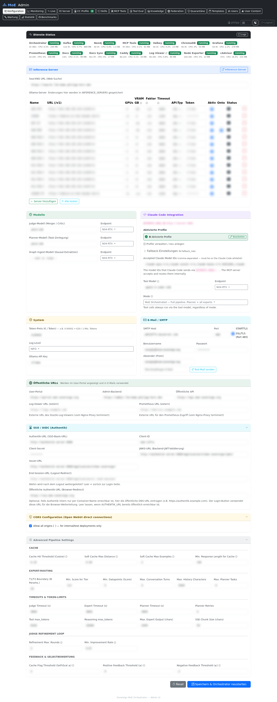
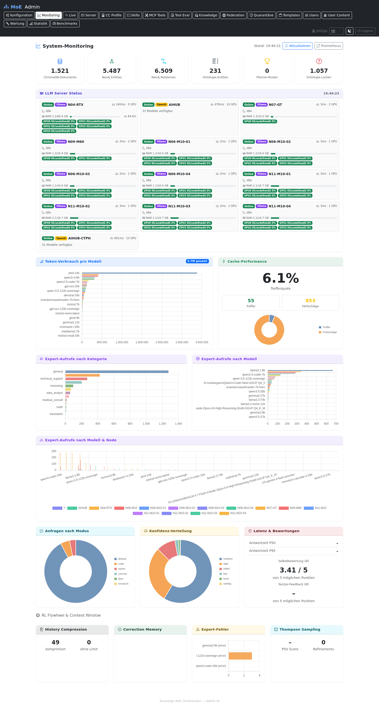
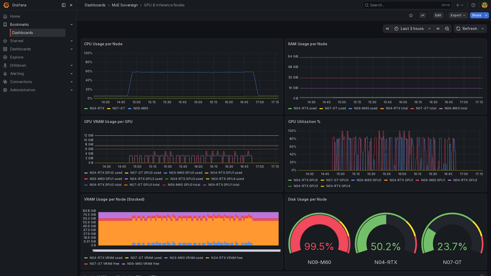
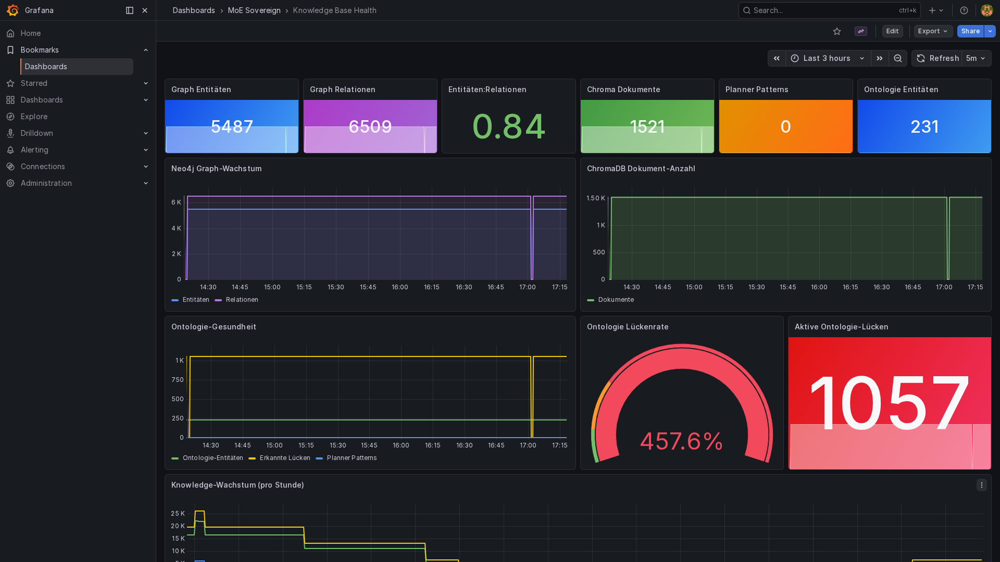

# UI Screenshots

Screenshots of all MoE Sovereign web interfaces. Generated automatically via Playwright.

---

## Admin UI

### Login

### Dashboard — Full Overview (with Advanced Pipeline Settings)

Full-page screenshot of the Admin UI dashboard including all configuration sections:
server tiles, model routing, SMTP, OIDC, CORS, and the expanded Advanced Pipeline Settings block.
All sensitive fields (URLs, credentials, API keys, server names) are privacy-blurred.

### Live Monitoring

Full-page screenshot of the monitoring view showing per-node GPU utilisation, inference
throughput, memory occupancy, and the gap-healer slot counters. Server tiles wait for
the background health-check to complete before capture.

### Dashboard — System Configuration

### Users & Roles

### Expert Templates

### Claude Code Profiles

### Inference Servers

### System Monitoring (legacy)

### Live Monitoring — Process History

### MCP Precision Tools

### Skills

### Tool Evaluation Log

---

## Grafana Dashboards

### MoE System Overview

### LLM & Expert Usage

### Knowledge Base Health

### Infrastructure & Resources

### User Metrics

### Dashboard List

---

## Prometheus

### Query Interface

### Scrape Targets

---

## Grafana — GPU & Inference Nodes

Real-time GPU utilisation, VRAM occupancy, and per-model inference throughput across all
heterogeneous nodes (RTX 4090, Tesla M60, Tesla M10, GT 1060). Captured in kiosk mode.

## Grafana — Knowledge Base Health

Neo4j entity count, relation count, gap-queue depth (`moe:ontology_gaps` ZCARD),
and per-template healing throughput over the last 24 hours.

## Dozzle — Log Viewer

Container log aggregation across all MoE Sovereign services, accessible without
SSH access. Useful for real-time debugging during ontology gap healing runs.

## Neo4j — Knowledge Graph (500+ Entities)

Neo4j Browser showing a 500-entity subgraph excerpt: entities (Framework, Concept,
Protocol, Tool) and their typed relations (IS_A, USES, IMPLEMENTS, PART_OF). The
graph is the product of autonomous healing over multiple sessions.

---

## MkDocs Documentation

### Home

### Architecture Page

### Webserver & Reverse Proxy

