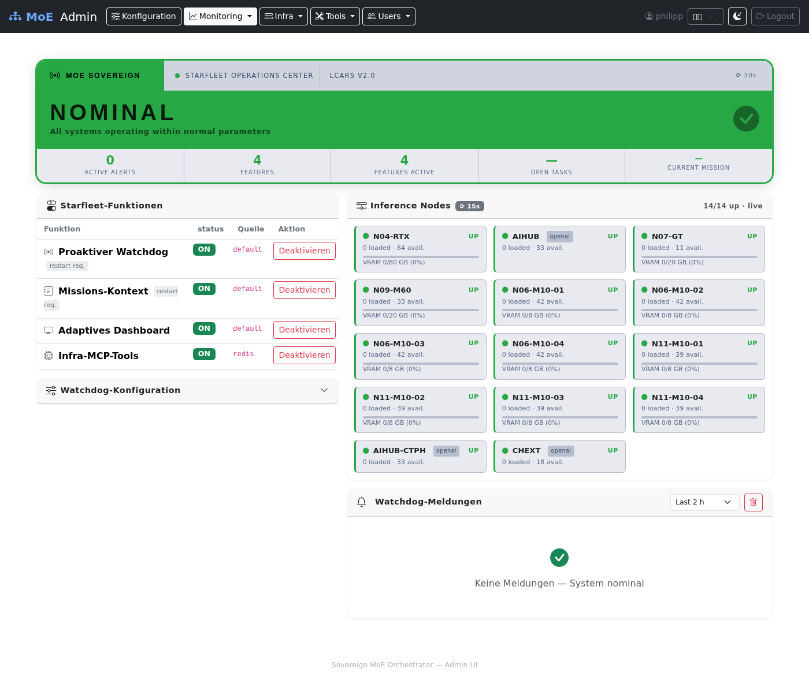

# Starfleet — Ambient Intelligence Dashboard

The **Starfleet** dashboard (`/starfleet` in the Admin UI) brings MoE Sovereign's operational
awareness one level beyond passive metrics: it actively monitors the system, pushes alerts
before problems escalate, and provides a single-pane view of infrastructure health, project
context, and feature configuration.

> **Navigation:** Admin UI → Monitoring → Starfleet



---

## LCARS Status Frame

The top section uses a **LCARS-inspired status frame** whose colour changes with the
current system state:

| State | Colour | Condition |
|---|---|---|
| **NOMINAL** | Green | No unresolved alerts in the selected time window |
| **DEGRADED** | Amber | VRAM above threshold or stuck benchmark |
| **CRITICAL** | Red (pulsing) | One or more nodes unreachable |
| **BENCHMARK** | Blue | Heavy inference load active for > 2 min |
| **UNREACHABLE** | Grey | Orchestrator container not responding |

The metrics strip below the banner shows at a glance: active alerts, features enabled,
open mission tasks, and the current mission title.

---

## Inference Node Grid (Live)

The **Inference Nodes** panel performs **parallel live health checks** every 15 seconds
without reloading the page.

- **Ollama nodes** — checked via `GET /api/tags` (model count) + `/api/ps` (VRAM usage)
- **OpenAI-compatible endpoints** — checked via `GET /models` with Bearer token auth
- Three states: **UP** (green), **DOWN** (red), **UNKNOWN** (grey — endpoint without token)
- VRAM bar shows current utilisation with colour thresholds: amber ≥ 75 %, red ≥ 90 %
- Results are cached in Valkey for 20 s — rapid refreshes never hammer the nodes

**Example:** After N06-M10-01 loads a 7B model, its VRAM bar immediately reflects
`4.2 / 8 GB (52 %)` on the next 15 s poll without any manual refresh.

---

## Proactive Watchdog

The **Watchdog** runs as a background loop in the orchestrator container, evaluating
thresholds every 60 seconds using Prometheus gauges that are already collected by the
existing gauge loop — **zero additional HTTP calls to inference nodes**.

### Alert types

| Alert | Severity | Fires when |
|---|---|---|
| `NODE_DOWN` | Critical | Node unreachable for ≥ N consecutive cycles (configurable, default 2 = 120 s) |
| `NODE_RECOVERED` | Info | Node back online after a `NODE_DOWN` state |
| `VRAM_HIGH` | Warning | VRAM usage ≥ threshold (default 90 %) on a node |
| `BENCHMARK_STUCK` | Warning | Active request count frozen for ≥ 30 min |

**False-positive avoidance:**

- 2-cycle **grace period** after container restart (gauges default to 0 before first poll)
- Stale alerts (older than the selected time window) are shown at 45 % opacity and do
  **not** influence the LCARS system state
- `NO_MODELS_LOADED` is intentionally omitted — idle VRAM is Ollama's normal state

### Alert list controls

- **Time filter** — dropdown: Last 30 min / 2 h / 8 h / 24 h / All
- **🗑 Clear** — deletes all stored alerts immediately (requires confirmation)
- Alerts are persisted in Valkey (`moe:watchdog:alerts`, max 100 entries LIFO)

---

## Email Escalation

When configured, the watchdog sends HTML emails for alerts matching the configured
severity levels, with **per-alert cooldown** to prevent notification storms.

**Example workflow:**

1. N09-M60 becomes unreachable at 03:14.
2. After 2 cycles (120 s), a `NODE_DOWN / critical` alert fires.
3. An email is sent to `ops@example.org` with a colour-coded HTML body.
4. The cooldown key `moe:watchdog:cooldown:node_down:N09-M60` is set in Valkey with a
   30-minute TTL.
5. No further email is sent for this node/alert-type until the TTL expires — even if
   the alert fires again every 60 s.
6. When the node recovers, a `NODE_RECOVERED / info` email fires (if info is in the
   configured severity list).

### Configuring email escalation

Open the **Watchdog-Konfiguration** panel on the Starfleet page and fill in:

| Field | Description |
|---|---|
| Escalation email | Recipient address (single address or distribution list) |
| Cooldown (min) | Minimum gap between two mails for the same alert type / node |
| Escalate severities | Multi-select: Info / Warning / Critical |
| **Test-Mail senden** | Sends a test email immediately to verify SMTP settings |

All threshold changes are **hot-reload** — they take effect on the next 60 s watchdog
cycle without restarting any container.

---

## Mission Context

**Mission Context** is a cross-session project state document stored at
`$MOE_DATA_ROOT/mission_context.json`.

It contains:
- Project title and description
- Open tasks (checklist items currently in flight)
- Recent decisions (timestamped log)
- Active nodes (which inference nodes are relevant to this mission)
- Tags

### Why it matters

Without Mission Context, every conversation starts from zero. With it, experts receive a
compact project summary as a **system-prompt preamble**, giving them immediate awareness
of what is being built, what has already been decided, and what is still open.

**Example:**

```
## Mission Context: Star Trek Feature Sprint
Open tasks: Test watchdog; Verify LCARS theme; Update docs
Last decision: NOMINAL = green, not amber (2026-04-30)
```

This preamble is injected **before** the expert's own system prompt, so the expert knows
the project context before processing the user's query.

### Enabling per template

Mission Context injection is **opt-in per expert template**:

1. Open Admin UI → Tools → Expert Templates
2. Edit a template → **Pipeline Toggles** → enable **Mission Context**
3. Save

The system-wide feature switch (Starfleet → Starfleet-Funktionen → Missions-Kontext)
must also be enabled. If the system switch is off, no template can use it regardless of
its own setting.

### API

```
GET  /api/mission-context          # read current context
POST /api/mission-context          # replace context
PATCH /api/mission-context         # merge-update individual fields
```

---

## Feature Toggles

The **Starfleet-Funktionen** panel controls all four ambient intelligence features:

| Feature | Default | Requires restart | Description |
|---|---|---|---|
| Proaktiver Watchdog | ON | Yes | Background alert loop |
| Missions-Kontext | ON | Yes | Cross-session project state |
| Adaptives Dashboard | ON | No | LCARS UI enabled |
| Infra-MCP-Tools | OFF | Yes | Read-only MCP tools for self-introspection |

**Two-layer toggle system:**

1. `.env` flag (e.g. `WATCHDOG_ENABLED=true`) — persists across restarts
2. Redis key `moe:features:<name>` — runtime override, takes effect immediately,
   survives until explicitly cleared or the Redis instance is flushed

```bash
# Disable watchdog at runtime without restart
redis-cli SET moe:features:watchdog false

# Re-enable
redis-cli SET moe:features:watchdog true
```

---

## Infra MCP Tools

When `INFRA_MCP_ENABLED=true`, four read-only MCP tools become available to the
orchestrator's AI pipeline:

| Tool | Returns |
|---|---|
| `node_status` | Live health, VRAM, loaded models per node |
| `active_requests` | Count of in-flight LLM requests |
| `mission_context_get` | Current mission context document |
| `watchdog_alerts` | Recent alert history |

**Example use case:** An agentic coding session can call `node_status()` before
dispatching a large batch job to confirm that the target inference node has sufficient
free VRAM — without the user having to check the dashboard manually.

---

## Configuration Reference

All Starfleet settings live in the `STARFLEET FEATURES` section of `.env`:

```env
WATCHDOG_ENABLED=true
WATCHDOG_DOWN_THRESHOLD=2        # cycles before NODE_DOWN fires
WATCHDOG_INTERVAL_SECONDS=60     # evaluation cadence
WATCHDOG_VRAM_THRESHOLD=0.90     # 90% VRAM triggers VRAM_HIGH
MISSION_CONTEXT_ENABLED=true
ADAPTIVE_UI_ENABLED=true
INFRA_MCP_ENABLED=false
```

Thresholds can also be changed live via the Watchdog-Konfiguration panel or directly:

```bash
curl -X POST http://localhost:8002/api/watchdog/config \
  -H "Content-Type: application/json" \
  -d '{"down_threshold": 3, "vram_threshold": 0.85}'
```
