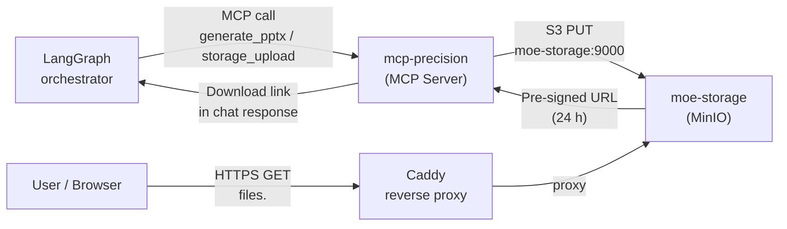

# Object Storage — moe-storage (MinIO)

MoE Sovereign ships an embedded S3-compatible object store (`moe-storage`) powered by
[MinIO](https://min.io/). It provides persistent file storage for generated artefacts
(PowerPoint presentations, exports, attachments) and delivers them as time-limited
pre-signed download links directly in chat responses.

---

## Architecture



The MCP server creates the pre-signed URL using the **internal** MinIO endpoint
(`moe-storage:9000`) and then rewrites the host part to the **public** URL
(`MINIO_PUBLIC_URL`) before returning it in the chat response. This means the link
is directly clickable by the end user without exposing internal hostnames.

---

## Docker Service

| Property | Value |
|---|---|
| Container | `moe-storage` |
| Image | `quay.io/minio/minio:latest` |
| S3 API port | `9000` (internal only) |
| Web Console port | `9001` (internal only) |
| Reverse proxy | `files.<domain>` → port 9000 (S3 API) |
| Reverse proxy | `storage.<domain>` → port 9001 (Web Console) |
| Data volume | `moe_storage_data:/data` |
| CPU limit | 0.5 vCPU |

---

## Configuration

All variables go into `.env` (copy from `.env.example`):

```env
# Root credentials — set once on first start, never change without migrating the volume
MINIO_ROOT_USER=moe-admin
MINIO_ROOT_PASSWORD=<at-least-8-chars>

# Internal Docker endpoint used by mcp-precision to upload files
MINIO_ENDPOINT=moe-storage:9000

# Public-facing base URL rewritten into pre-signed links
# Must match the reverse proxy hostname for files.<domain>
MINIO_PUBLIC_URL=https://files.<your-domain>
```

!!! warning "Password immutability"
    `MINIO_ROOT_PASSWORD` is written to the data volume on first start.
    Changing it afterwards without migrating the volume will lock you out.
    Use `openssl rand -hex 24` to generate a strong password before starting.

---

## MCP Tools

The MCP Precision server exposes two storage-related tools:

### `generate_pptx`

Generates a `.pptx` presentation from structured content and returns a download link.

| Parameter | Type | Description |
|---|---|---|
| `title` | string | Presentation title |
| `slides` | list | List of slide objects with `heading`, `bullets`, `notes` |
| `bucket` | string | Target MinIO bucket (default: `moe-files`) |

Returns: `Download URL (24h): https://files.<domain>/moe-files/<filename>.pptx?...`

### `storage_presign`

Generates a time-limited pre-signed URL for an existing object.

| Parameter | Type | Description |
|---|---|---|
| `bucket` | string | Bucket name |
| `object_name` | string | Object path within the bucket |
| `hours` | int | Link validity in hours (default: 24) |

---

## Bucket Setup

On first use, the MCP server auto-creates the bucket if it does not exist.
Buckets are private by default — access is only possible via pre-signed URLs.

To manage buckets manually via the Web Console:

1. Navigate to `https://storage.<your-domain>`
2. Login with `MINIO_ROOT_USER` / `MINIO_ROOT_PASSWORD`
3. Create / inspect buckets under **Buckets → Create Bucket**

---

## Reverse Proxy (Caddyfile)

Copy `Caddyfile.example` to `Caddyfile` and replace `<YOUR-DOMAIN>`:

```caddy
# MinIO S3 API — download links point here
files.<YOUR-DOMAIN> {
    tls internal
    reverse_proxy moe-storage:9000
}

# MinIO Web Console — admin access
storage.<YOUR-DOMAIN> {
    tls internal
    reverse_proxy moe-storage:9001
}
```

---

## Storage Capacity

MinIO runs on the `moe_storage_data` Docker volume. Default allocation depends on
the host disk. Monitor usage via:

```bash
sudo docker exec moe-storage mc admin info local
```

Or in the Admin UI → **Monitoring** → Disk Usage panel.

---

## Troubleshooting

| Symptom | Likely cause | Fix |
|---|---|---|
| `generate_pptx` returns error "connection refused" | `moe-storage` container not running | `sudo docker compose up -d moe-storage` |
| Download link unreachable | `MINIO_PUBLIC_URL` not set or wrong | Check `.env` → `MINIO_PUBLIC_URL` matches Caddy hostname |
| Login to Web Console fails | Wrong root credentials | Credentials are stored in volume — cannot change without migrating |
| Bucket does not exist | Auto-create failed | Create manually via Web Console or `mc mb local/<bucket>` |
