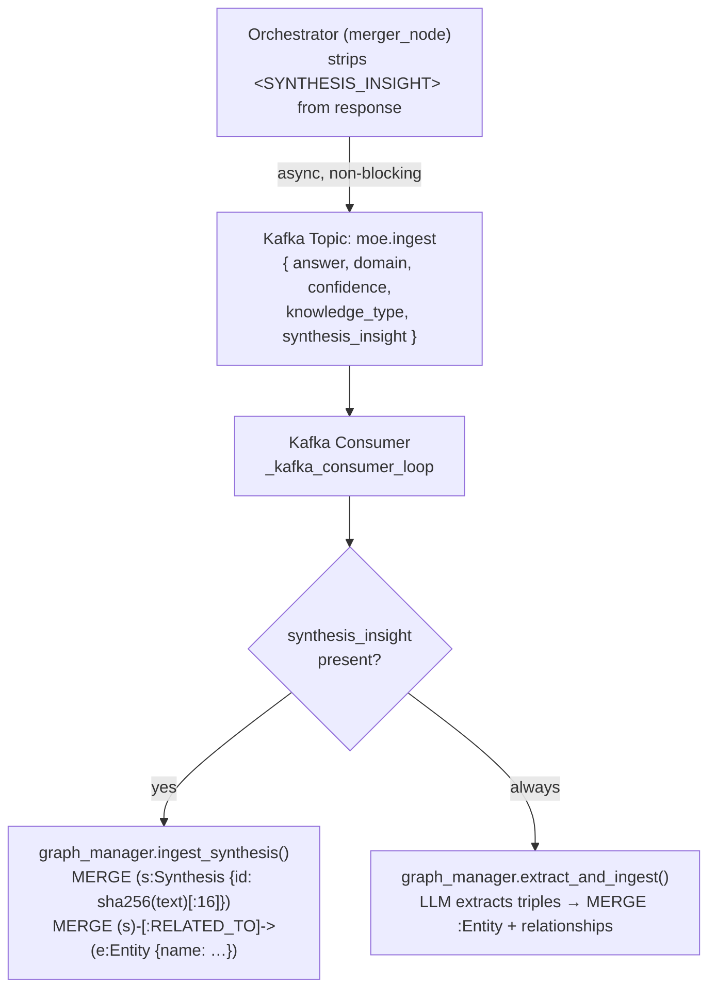
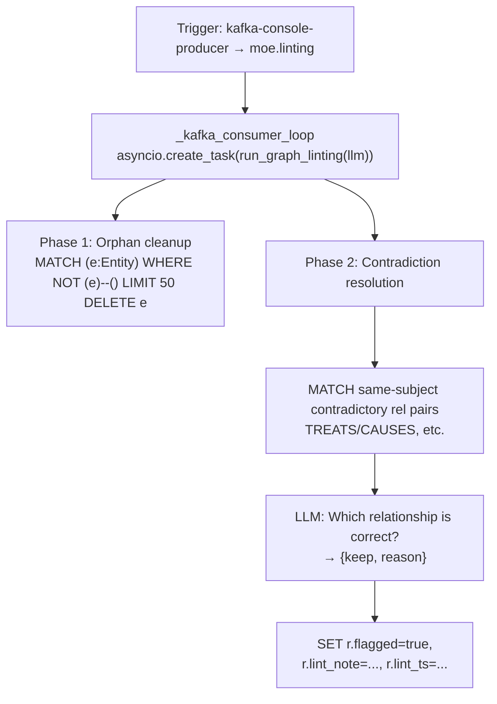

# GraphRAG / Neo4j — Temporal Knowledge Graph

## What is GraphRAG?

GraphRAG (Graph Retrieval-Augmented Generation) is an extension of the classical RAG approach. Instead of storing texts as vectors in a flat embedding space, entities and their relationships are persisted as a property graph with timestamps.

Sovereign MoE uses **Neo4j** as the graph database and a custom `GraphRAGManager` in `graph_rag/manager.py`.

## Why GraphRAG instead of pure Vector RAG?

**Vector degeneration** is a structural problem: as the document count grows, embeddings converge in the high-dimensional space. After 10,000+ documents, similarity scores become indistinguishable, and top-K retrieval quality degrades.

A property graph does not have this problem because knowledge is stored structurally — as nodes, edges, and properties — not as numerical approximation vectors.

Additional advantages in the MoE context:

**Temporal queries** — every knowledge node carries a `created_at` timestamp. Cypher queries can filter by time: "What knowledge was learned about Expert X in the last 7 days?"

**Structured relations** — relationship types such as `USED_BY`, `PRODUCED_BY`, `CONTRADICTS`, `SUPPORTS` enable semantic reasoning over the graph that no embedding can provide.

**Expert performance tracking** — feedback events are stored as edges between query nodes and expert nodes. Graph traversal allows determining which expert historically performed best on which topic type.

## Ontology (excerpt)

The graph currently contains 104+ entity types and 100 relation types. Key node classes:

| Node type | Description |
|---|---|
| `Entity` | Core node label — all extracted knowledge nodes (Drug, Disease, Action, Location, …) |
| `Synthesis` | Novel multi-source insights produced by the merger_node; linked to related entities via `:RELATED_TO` |
| `Query` | Incoming user request with embedding and category |
| `Response` | Generated response, linked to query and expert |
| `Expert` | Expert profile (name, model, performance score) |
| `Concept` | Extracted knowledge concept from responses |
| `Source` | SearXNG search result or document |
| `FeedbackEvent` | User feedback (positive/negative) with timestamp |

### `:Synthesis` Node

A `:Synthesis` node captures a high-level insight that the merger synthesized from multiple expert results. It is **not** a standard [Subject]–[Predicate]–[Object] triple; it is a free-text summary anchored to named entities.

```
(s:Synthesis {
  id:           "a3f8b1c2d4e5f6a7",   -- sha256(text)[:16], idempotent
  text:         "...",                  -- full insight (max 500 chars)
  insight_type: "comparison",           -- "comparison" | "synthesis" | "inference"
  entities:     ["Ibuprofen", "COX-2"], -- list for quick entity lookup
  domain:       "medical_consult",
  source_model: "phi4:14b",
  confidence:   0.85,
  created:      1712345678901            -- unix ms timestamp
})
```

Relationships:

```cypher
(s:Synthesis)-[:RELATED_TO]->(e:Entity)
```

This means a 2-hop traversal from any linked entity will surface relevant synthesis nodes in future `graph_rag_node` contexts.

## Kafka Ingest Pipeline

The orchestrator does **not write directly** to Neo4j. Instead, events are published to the Kafka topic `moe.ingest`. A dedicated consumer process reads these events and executes Cypher MERGE operations:



This decoupling is critical: a slow Neo4j write never blocks the HTTP response path. The response is returned to the client while the graph is updated in the background.

## Graph Linting

The `moe.linting` Kafka topic triggers on-demand graph maintenance via `graph_manager.run_graph_linting()`:



See [Graph-basierte Wissensakkumulation](../intelligence/compounding_knowledge.md) for the full operational guide.

## Retrieval in the Pipeline Node

The `graph_rag` node in the LangGraph pipeline calls `graph_rag/manager.py`:

```python
# Simplified flow
async def graph_rag_node(state: MoEState) -> MoEState:
    context = await graph_manager.retrieve(
        query=state["query"],
        limit=5,
        since_days=30          # Only knowledge from the last 30 days
    )
    state["graph_result"] = context
    return state
```

The retrieval combines:
1. Full-text index search over `Concept` nodes (Neo4j Lucene)
2. Traversal over `RELATED_TO` edges to related concepts
3. Time filter via `created_at` property

## Configuration

```bash
# .env
NEO4J_URI=bolt://neo4j:7687
NEO4J_USER=neo4j
NEO4J_PASSWORD=<secret>
```

**Port:** 7687 (Bolt), 7474 (Browser UI)  
**Health check:** `GET http://localhost:7474`  
**Manager:** `graph_rag/manager.py` — contains schema init, MERGE queries, and retrieval logic  
**Kafka topic:** `moe.ingest` (JSON events with `type`, `payload`, `timestamp`)
