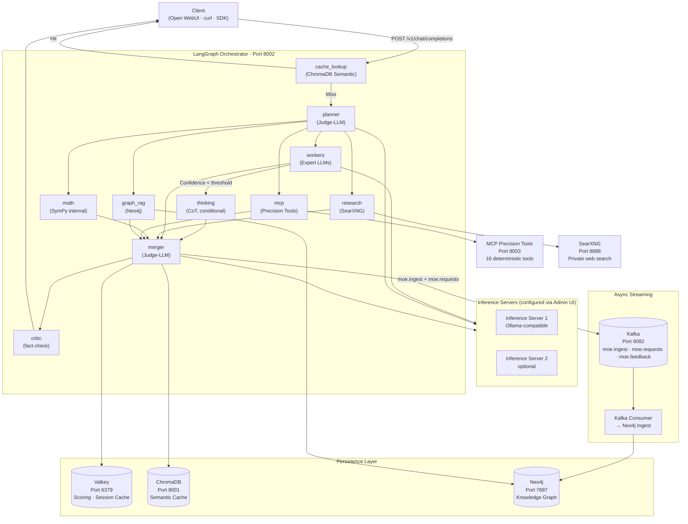

# Tool Stack Overview

Sovereign MoE combines several specialized open-source components into a coherent orchestration stack. Each component solves a specific problem that could not be solved with a single, monolithic LLM system.

## Architecture Diagram

## Component Overview

| Component | Role | Port | Documentation |
|---|---|---|---|
| **LangGraph** | Orchestration, parallel fan-out, state management | internal | [langgraph.md](langgraph.md) |
| **Ollama** | Multi-node LLM inference | 11434 | [ollama_cluster.md](ollama_cluster.md) |
| **Neo4j** | Temporal GraphRAG, knowledge graph | 7687 | [graphrag_neo4j.md](graphrag_neo4j.md) |
| **Valkey** | Expert scoring, session cache | 6379 | — |
| **ChromaDB** | Semantic response cache | 8001 | — |
| **Kafka** | Async ingest buffer, audit log | 9092 | [Kafka docs](../kafka.md) |
| **SearXNG** | Private web search (no Google tracking) | 8888 | — |
| **MCP Server** | 16 deterministic precision tools | 8003 | [mcp_tools.md](mcp_tools.md) |

## Design Principles

**Determinism over LLM estimation** — calculations, hashes, date operations, and network subnet calculations always run through the MCP server, never through a language model.

**Decoupling via Kafka** — the HTTP response path and data persistence are completely separated. A Kafka outage blocks no responses, only later graph learning.

**Heterogeneous hardware** — Ollama abstracts different GPU generations (consumer cards to enterprise Tesla) behind a unified OpenAI API. Inference servers are configured via Admin UI → Servers, with priority routing weighted by availability.

**No vendor lock-in** — all components are self-hosted. SearXNG instead of Google, Ollama instead of OpenAI, Neo4j Community instead of vector-based cloud services.
