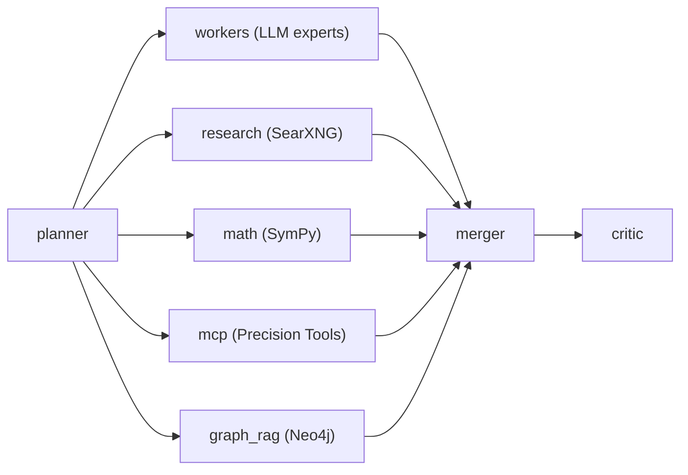

# LangGraph — Orchestration & State Management

## What is LangGraph?

LangGraph is a state machine framework from the LangChain ecosystem that defines directed acyclic graphs (DAGs) for LLM workflows. Each node is a Python function that reads from and writes to a shared state. Edges between nodes can be conditional (conditional edges).

Unlike simple LLM chains, LangGraph supports:

- **Parallel execution** — multiple nodes start simultaneously
- **Conditional branching** — a node decides which next node to call
- **Persistent state** — all intermediate results are retained in the state object
- **Cycles** — graphs can contain loops (e.g. self-correction)

## Why LangGraph in Sovereign MoE?

The core challenge of a MoE system is **parallel expert consultation followed by synthesis**. A sequential approach (Expert A → Expert B → Judge) would be 3–5× slower.

LangGraph solves this through **fan-out/fan-in**:



All five branches run concurrently via `asyncio`. The `merger` node waits for all results before starting the judge synthesis.

LangGraph also controls **conditional CoT** (Chain-of-Thought): if an expert worker returns a confidence below the configured threshold, the `thinking` node is inserted, forcing explicit step-by-step reasoning.

## Pipeline Nodes

| Node | Function | Conditional? |
|---|---|---|
| `cache_lookup` | Check ChromaDB semantic cache | Yes — hit: direct response |
| `planner` | Judge LLM analyzes query, selects branches | No |
| `workers` | Parallel expert LLM calls via LiteLLM | No |
| `research` | SearXNG web search, result summarization | No |
| `math` | SymPy-based equation solving | No |
| `mcp` | Deterministic tool call via MCP server | No |
| `graph_rag` | Neo4j Cypher query for contextual knowledge | No |
| `thinking` | Chain-of-thought prompt for low confidence | Yes — only on low confidence |
| `merger` | Judge LLM synthesizes all branch results | No |
| `critic` | Fact-check of the final output | No |

## State Type: MoEState

All nodes read from and write to a shared state. The type is defined as a TypedDict in `main.py`:

```python
class MoEState(TypedDict):
    messages: list[dict]          # Full conversation history
    query: str                    # Current request
    plan: dict                    # Planner decision (which branches)
    worker_results: list[dict]    # Results from all expert workers
    research_result: str          # SearXNG summary
    math_result: str              # SymPy result
    mcp_result: dict              # MCP tool result
    graph_result: dict            # Neo4j context
    thinking_result: str          # CoT output (optional)
    final_answer: str             # Synthesized answer
    confidence: float             # Overall confidence
    cache_hit: bool               # Was the cache successful?
```

## Configuration

LangGraph is configured directly in `main.py` — no external config file. The graph is built once at startup:

```python
from langgraph.graph import StateGraph

workflow = StateGraph(MoEState)
workflow.add_node("cache_lookup", cache_lookup_node)
workflow.add_node("planner", planner_node)
# ... additional nodes ...
workflow.add_conditional_edges("cache_lookup", route_cache, {...})
workflow.set_entry_point("cache_lookup")
app_graph = workflow.compile()
```

For changes to the graph structure or new nodes, a **GitHub Issue** is required before submitting a PR (see [CONTRIBUTING.md](../../../../CONTRIBUTING.md)).
