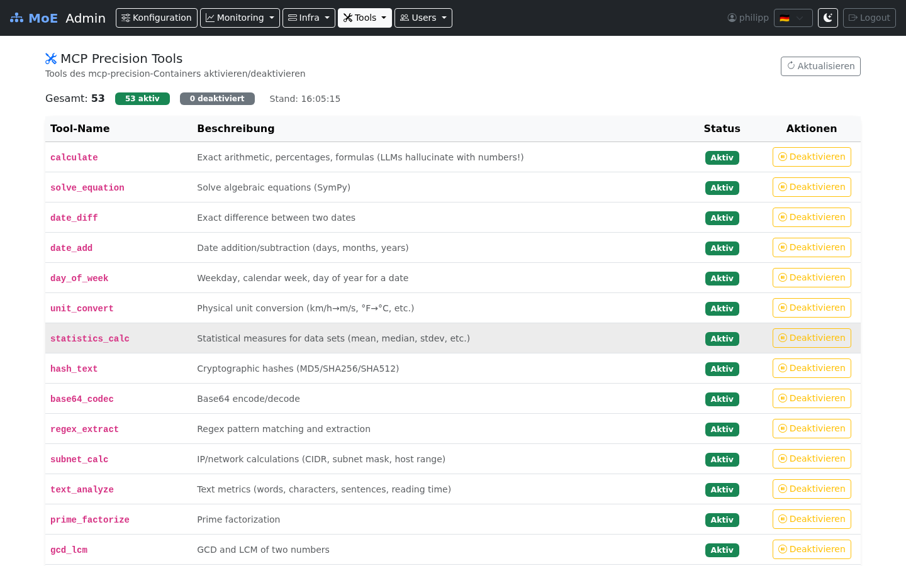

# MCP Precision Tools — Deterministic Computations

## What is the MCP Server?

The MCP server (`mcp_server/server.py`) exposes a dynamic catalogue of
deterministic computations and bounded infrastructure connectors behind a
unified REST API. Clients must discover the deployed set through `GET /tools`,
because tools can be added or administratively disabled. The service
implements the **Model Context Protocol (MCP)** and is also directly callable
via `/invoke`.



## Why Precision Tools instead of LLM computation?

**LLMs can hallucinate on computations.** Common error classes include:
- Multi-digit arithmetic
- Equations with parameters
- Date and time differences
- Subnet masking (CIDR)
- Unit conversions

...especially when the answer is embedded in natural language text.

For a declared precision task, the `mcp` node calls the service and returns
the deterministic result as execution evidence. An initial fail-closed intent
guard also prevents explicit GCD, km/h-to-m/s and German/English weekday
requests from silently becoming general LLM tasks. Other tool domains still
depend on planner selection and must not be described as completely offloaded
until they receive an equally typed intent contract.

MCP transport alone does not make a fact deterministic. Local calculations
can be reproducible from their input, while legal/public-data/search
connectors depend on a source snapshot and retrieval time. The full boundary
and prioritized gap analysis is in the
[deterministic offloading evaluation](deterministic_offloading_evaluation_2026-07-31.md).

**Pagination for code models** — Large code responses (e.g. AST analyses, regex extracts over long text) are paginated so code models with limited context windows are not overwhelmed.

## Core computation tools

The following table is the stable core, not an exhaustive registry. `GET
/tools` is authoritative and includes each tool's JSON input schema, enabled
state and access classification.

The orchestrator loads only entries whose live `enabled` state is true. A
successful reload replaces the executable schema catalogue as one set, so a
removed or disabled tool cannot remain plannable through stale process state.
If discovery fails, executable schemas are cleared and mandatory precision
contracts fail closed; static fallback descriptions are not execution proof.

### Versioned structured contracts

`calendar_facts`, `gcd_lcm`, `unit_convert`, `time_facts`,
`timezone_convert`, `decimal_finance`, `exact_probability` and
`structured_validate` publish version 1.0.0 contracts. Their discovery
entries include the complete input and output JSON Schemas, a canonical
contract hash, determinism/source metadata, normalization, retry and cache
policies, evidence-redaction rules and result-size limits. The current policy
applies documented schema defaults, rejects unknown properties, does not
permit argument mutation, performs one execution attempt, and bypasses answer
caches until the cache reader can revalidate the complete evidence envelope.

For these tools `/invoke` retains the legacy `result` field and adds
`structured_result`. The new envelope binds `contract_id`, version and hash,
normalized input, typed `facts`, determinism class, runtime source/version,
warnings and a canonical result hash. Both server and orchestrator validate
the schemas and hashes; malformed input, output, source metadata or hash data
cannot become completed evidence. The final quality gate revalidates the same
material before an API response may pass.

| Tool | Library | Description |
|---|---|---|
| `calculate` | Python `ast` (safe eval) | Arithmetic without `eval()` — safe against injection |
| `solve_equation` | SymPy | Algebraic equations with symbolic variables |
| `date_diff` | python-dateutil | Exact total days plus calendar years/months/days |
| `date_add` | python-dateutil | Date + time delta |
| `calendar_facts` | Python stdlib | Localized weekday and structured ISO calendar facts |
| `time_facts` | zoneinfo + pinned tzdata | Offset, DST, fold and calendar facts for an explicit instant |
| `timezone_convert` | zoneinfo + pinned tzdata | DST-safe conversion between explicit IANA time zones |
| `decimal_finance` | decimal (stdlib) | Decimal-string finance operations with explicit scale and rounding |
| `exact_probability` | fractions/math (stdlib) | Exact bounded rational probability and combinatorics |
| `structured_validate` | locked safe parser set | Bounded JSON, YAML, XML and CSV parsing/validation without network resolution |
| `day_of_week` | python-dateutil | Weekday for any date |
| `unit_convert` | pint | SI units, imperial measures, energy, pressure |
| `statistics_calc` | statistics (stdlib) | Mean, median, stdev, variance, mode |
| `hash_text` | hashlib | MD5, SHA-1, SHA-256, SHA-512 |
| `base64_codec` | base64 (stdlib) | Encode and decode |
| `regex_extract` | re (stdlib) | Regex match with group extraction |
| `subnet_calc` | ipaddress (stdlib) | CIDR, network address, broadcast, host range |
| `text_analyze` | — | Word/char/sentence count, readability score |
| `prime_factorize` | — | Prime factorization |
| `gcd_lcm` | math (stdlib) | Greatest common divisor, least common multiple |
| `json_query` | jmespath | JMESPath queries on JSON structures |
| `roman_numeral` | — | Arabic ↔ Roman |

## API Reference

**Base URL:** `http://localhost:8003`

### Invoke a tool

```bash
POST /invoke
Content-Type: application/json

{
  "tool": "calculate",
  "args": {"expression": "2 ** 32 - 1"}
}
```

Response:
```json
{"result": 4294967295}
```

Versioned precision tools additionally return:

```json
{
  "result": "GCD(391, 299) = 23  |  LCM(391, 299) = 5083",
  "tool": "gcd_lcm",
  "structured_result": {
    "status": "completed",
    "tool": "gcd_lcm",
    "contract_id": "moe.precision.gcd_lcm",
    "contract_version": "1.0.0",
    "contract_hash": "<sha256>",
    "input_normalized": {"a": 391, "b": 299, "operation": "both"},
    "facts": {"a": 391, "b": 299, "operation": "both", "gcd": 23, "lcm": 5083},
    "determinism": "input_only",
    "source": {"kind": "python_stdlib", "name": "math", "version": "<python-version>", "as_of": null},
    "warnings": [],
    "result_hash": "<sha256>"
  }
}
```

Calendar example:

```json
{
  "tool": "calendar_facts",
  "args": {"date_str": "2026-07-29", "locale": "de"}
}
```

The result is a stable JSON string containing `weekday_name`, `weekday_iso`,
`iso_week`, `iso_week_year`, `day_of_year`, `days_in_month`,
`is_leap_year`, `quarter` and related normalized fields. Relative dates are
rejected because a reproducible answer needs an explicit clock and time zone.

`time_facts` and `timezone_convert` likewise require explicit ISO values and
IANA zone names. Naive local times that fall into a DST gap are rejected;
ambiguous fold times require an explicit `fold` selection. The production
image pins `tzdata==2026.3`, and the runtime version is part of the evidence.

`decimal_finance` accepts canonical decimal strings rather than binary
floats. Scale, rounding and currency are explicit inputs; exchange rates,
tax law and jurisdictional rules are intentionally outside this input-only
contract. `exact_probability` keeps `Fraction` as the exact result and emits
a Decimal projection only when both scale and rounding were requested.

`structured_validate` applies strict payload, schema, depth, node, row,
column and field limits. YAML aliases/tags, XML DTD/entities/XInclude and JSON
Schema references are rejected. Raw payload and schema contents are replaced
with SHA-256 and byte-count records at evidence and telemetry boundaries.

### Additional endpoints

```bash
GET /health      # Service status and currently registered tool names
GET /tools       # Authoritative catalogue, enabled state and argument schemas
GET /mcp/sse     # MCP SSE stream (for MCP-compatible clients)
```

## Adding a new tool

Tools are fully self-contained in `mcp_server/server.py`. A minimal example:

```python
async def roman_numeral(args: dict) -> dict:
    """
    Converts between Arabic and Roman numerals.
    Args: {"number": int} or {"roman": str}
    """
    try:
        if "number" in args:
            n = int(args["number"])
            # ... conversion logic ...
            return {"roman": result}
        elif "roman" in args:
            # ... reverse conversion ...
            return {"number": result}
        else:
            return {"error": "Provide either 'number' or 'roman'"}
    except Exception as e:
        return {"error": str(e)}
```

Afterwards:
1. Decorate/register the function with `@mcp.tool()`.
2. Add it to `_TOOL_REGISTRY`, `_TOOL_DESCRIPTIONS` and
   `_TOOL_ACCESS_KIND`; startup logging identifies missing classifications.
3. Add focused tests for the direct function and the REST `/invoke` contract.
4. Document stable public semantics here; do not duplicate the generated
   schema listing.


## File Generation Tool

The `generate_file` tool creates downloadable files from text content. It is
used by the orchestrator's output skill system to produce formatted deliverables.

### Supported Formats

| Format | Extension | Library | Notes |
|--------|-----------|---------|-------|
| HTML | `.html` | Built-in | Content wrapped in a styled HTML template |
| DOCX | `.docx` | python-docx | Headings (`#`, `##`, `###`) and paragraphs parsed from content |
| PPTX | `.pptx` | python-pptx | `##` headings become slide titles; body lines become bullet points |
| Markdown | `.md` | Built-in | Raw content written as-is |
| Plain Text | `.txt` | Built-in | Raw content written as-is |

### API Usage

```bash
POST /invoke
Content-Type: application/json

{
  "tool": "generate_file",
  "args": {
    "content": "# Report\n\nFindings paragraph...",
    "filename": "security-audit",
    "format": "docx"
  }
}
```

Response:
```json
{
  "result": "File generated: a1b2c3d4e5f6_security-audit.docx (12.3 KB)\nDownload: /downloads/a1b2c3d4e5f6_security-audit.docx"
}
```

### Download Endpoint

Generated files are served via a static download endpoint:

```
GET /downloads/{filename}
```

| Property | Value |
|----------|-------|
| Storage directory | `/app/generated/` |
| Filename format | `{uuid12}_{sanitized_name}.{ext}` |
| Auto-cleanup | Files are deleted after 24 hours |
| Content-Type | Inferred from extension (e.g., `application/vnd.openxmlformats-officedocument.wordprocessingml.document` for DOCX) |

---

## Deployment

```yaml
# docker-compose.yml (excerpt)
mcp-precision:
  build:
    context: .
    dockerfile: mcp_server/Dockerfile
  ports:
    - "127.0.0.1:${MCP_HOST_PORT}:8003"
  environment:
    - NEO4J_URI=bolt://neo4j:7687
```

- **Port:** 8003
- **Dockerfile:** `mcp_server/Dockerfile`
- **Dependency intent:** `mcp_server/requirements.txt`
- **Build authority:** `mcp_server/requirements.lock.txt` (exact transitive versions)
