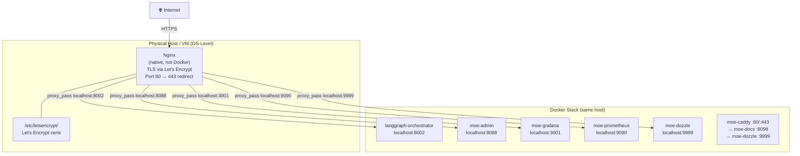
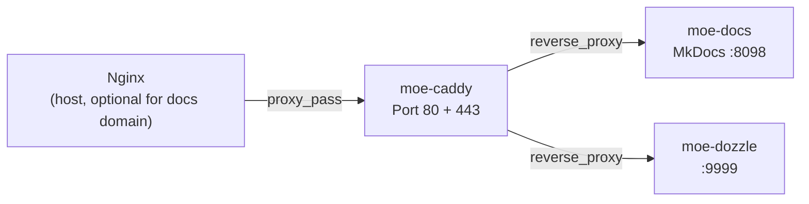
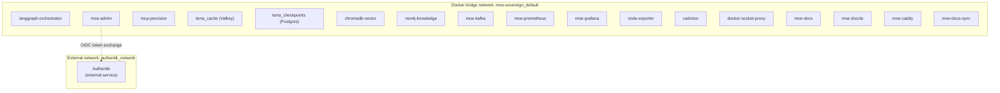

# Webserver & Reverse Proxy Architecture

## Overview

MoE Sovereign uses a **two-tier reverse proxy model**: an external Nginx running natively
on the host handles public TLS termination and port routing, while an internal Caddy container
provides TLS for the documentation domain only.

---

## Tier 1 — Host-Level Nginx (External)

The host Nginx is **not** a Docker container. It runs directly on the OS of the VM/server
that hosts the Docker stack, and it is responsible for:

- **TLS termination** via Let's Encrypt (certbot / acme) — certificates are managed at the
  OS level, not inside any container
- **Reverse proxying** of external HTTPS requests to the corresponding Docker service port
  on `localhost`
- **Public URL mapping** — each configured public URL (e.g. `api.example.com`) points to
  a specific host port via `proxy_pass`



### Typical Nginx Virtual Host Mapping

| External HTTPS URL | `proxy_pass` target | Docker service |
|--------------------|---------------------|----------------|
| `api.example.com` | `http://localhost:8002` | `langgraph-orchestrator` |
| `admin.example.com` | `http://localhost:8088` | `moe-admin` |
| `grafana.example.com` | `http://localhost:3001` | `moe-grafana` |
| `metrics.example.com` | `http://localhost:9090` | `moe-prometheus` |
| `logs.example.com` | `http://localhost:9999` | `moe-dozzle` |

The exact URLs are configured in the Admin UI under **Configuration → Public URLs**.
The `LOG_URL` and `PROMETHEUS_URL_PUBLIC` fields store the external URLs for the
log viewer and Prometheus — these are informational links used in the Admin UI dashboard.

### Let's Encrypt Configuration

TLS certificates are managed by `certbot` on the host:

```bash
# Obtain certificate (example)
sudo certbot --nginx -d api.example.com -d admin.example.com

# Auto-renewal via systemd timer or cron
sudo certbot renew --dry-run
```

Certificates reside in `/etc/letsencrypt/live/<domain>/` and are referenced from the
Nginx virtual host configuration. Docker containers do not have access to these certificates.

---

## Tier 2 — Internal Caddy Container

The `moe-caddy` container is a **Docker-internal** reverse proxy that exclusively manages
the MkDocs documentation domain. It handles its own TLS via the Caddy automatic HTTPS
mechanism (separate from host-level Let's Encrypt).



The `moe-caddy` service depends on `moe-docs` and `moe-dozzle`. Its Caddyfile configures
both upstreams within the same Docker network.

---

## Docker Network Architecture

All containers share the `default` (bridge) network created by Docker Compose. An additional
`authentik_network` is joined by `moe-admin` for server-side OIDC token exchange with Authentik.



---

## Port Reference — All Services

| Service | Host Port | Container Port | Protocol | Accessible Externally |
|---------|-----------|----------------|----------|-----------------------|
| `langgraph-orchestrator` | 8002 | 8000 | HTTP | Via Nginx (optional) |
| `mcp-precision` | 8003 | 8003 | HTTP | No (internal only) |
| `neo4j-knowledge` | 7474, 7687 | 7474, 7687 | HTTP / Bolt | No (internal only) |
| `terra_cache` | 6379 | 6379 | TCP | No (internal only) |
| `terra_checkpoints` | — | 5432 | TCP | No (internal only) |
| `chromadb-vector` | 8001 | 8000 | HTTP | No (internal only) |
| `moe-kafka` | 9092 | 9092 | TCP | No (internal only) |
| `moe-admin` | 8088 | 8088 | HTTP | Via Nginx (required) |
| `moe-prometheus` | 9090 | 9090 | HTTP | Via Nginx (optional) |
| `moe-grafana` | 3001 | 3000 | HTTP | Via Nginx (optional) |
| `node-exporter` | 9100 | 9100 | HTTP | No (internal scrape) |
| `cadvisor` | 9338 | 8080 | HTTP | No (internal scrape) |
| `docker-socket-proxy` | 2375 | 2375 | HTTP | No (internal only) |
| `moe-docs` | 8098 | 8000 | HTTP | Via moe-caddy / Nginx |
| `moe-dozzle` | 9999 | 8080 | HTTP | Via moe-caddy / Nginx |
| `moe-caddy` | 80, 443 | 80, 443 | HTTP/S | Via Nginx (optional) |

---

## Dozzle — Log Viewer


Dozzle provides a real-time log stream for all running Docker containers. Access is restricted via bcrypt-authenticated user accounts generated by `moe-dozzle-init`. The external URL is configured in the Admin UI as `LOG_URL`.

---

## Security Considerations

- **Docker socket access** is never granted directly to `moe-admin`. Instead, a
  `docker-socket-proxy` (tecnavia/docker-socket-proxy) is placed in front of the socket
  with read-only access configured via `CONTAINERS=1`, `SERVICES=1`, `TASKS=1`, `NETWORKS=1`.
- **Prometheus and Grafana** are accessible only via Nginx (with HTTP auth or SSO) —
  they should **not** be exposed on public interfaces without authentication.
- **`terra_checkpoints`** (Postgres) has no host port binding — it is only reachable
  within the Docker network.
- **Authentik SSO** integration uses server-side token exchange via the `authentik_network`
  Docker network — no client secrets are transmitted through the browser.

---

## Admin UI — External URL Configuration

The Admin UI (**Configuration → Public URLs**) stores four categories of public URL:

| Field | Env var | Purpose |
|-------|---------|---------|
| User Portal URL | `APP_BASE_URL` | Base URL shown to end users |
| Admin Backend | `PUBLIC_ADMIN_URL` | External admin URL (Authentik redirect URI sync) |
| Public API | `PUBLIC_API_URL` | OpenAI-compatible API endpoint for clients |
| Log Viewer URL | `LOG_URL` | External Dozzle URL (informational link in Admin UI) |
| Prometheus URL | `PROMETHEUS_URL_PUBLIC` | External Prometheus URL (informational link) |

Changes to `APP_BASE_URL`, `PUBLIC_ADMIN_URL`, and `PUBLIC_API_URL` are automatically
synced to the Authentik OAuth2 provider's `redirect_uris` list after saving.
